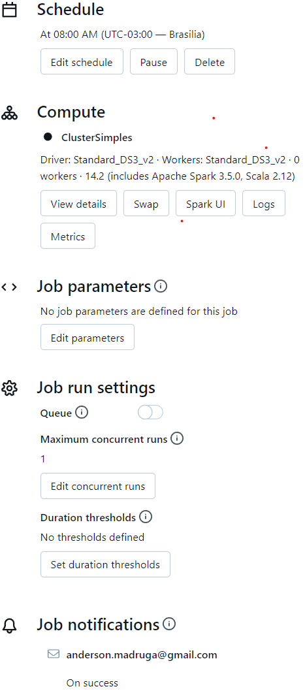
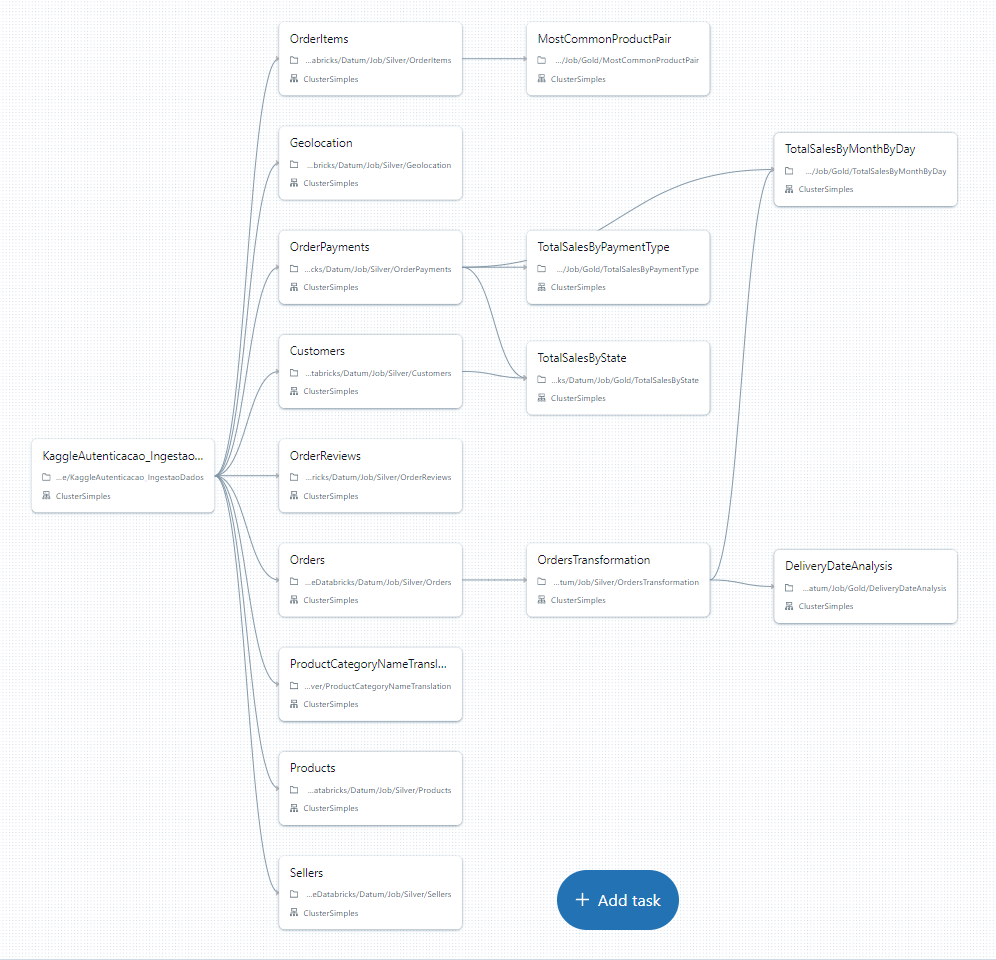

# Datum

Olá Datum. Tudo bem com vocês? Por aqui, tudo bem! :blush:

Neste repositório vocês encontrarão informações a respeito do meu teste técnico para a vaga de Desenvolvedor Python (job description compatível com Engenheiro de Dados).

## 1. DataSet

Para realizar o teste técnico, escolhi o [Brazilian E-Commerce Public Dataset by Olist]([https://www.exemplo.com](https://www.kaggle.com/datasets/olistbr/brazilian-ecommerce)https://www.kaggle.com/datasets/olistbr/brazilian-ecommerce). O diagrama de entidade e relacionamento foi fornecido:

## 2. Camada Bronze

[Arquivos da camada bronze](./bronze)

Nesta camada, um arquivo .ipynb que:
1. Faz a autenticação na api do kaggle, com minhas informações de usuário.
2. Faz o check da watermark que registra a data de ultima atualização do dataset no kaggle.
3. Faz o check dos arquivos na camada bronze no dbfs.

Basicamente, 
* se o **dataset não consta atualização** e já **estamos com os arquivos .csv no dbfs (camada bronze)**, o job falha e as camadas silver e gold não são processada.

* já se o **dataset sofreu atualização no kaggle** ou se "existem arquivos faltantes na camada bronze do dbfs**, o job é executado por completo.

Uma notificação é enviada por email caso o job rode por completo. O normal, aqui, é não executar essa pipeline completa, já que o dataset sofre poucas atualizações. Trigger, notificação e as tasks do workflow:

## 3. Camada Silver
[Arquivos da camada silver](./silver)

Na camada silver eu crio dataframes a partir dos dados .csv da camada bronze. Em seguida, defino schema, faço transformações básicas (como a que vocês pediram -> adição de colunas calculadas) e exporto os datos em delta para a camada silver. Todos os notebooks da camada silver seguem esta lógica.

## 4. Camada Gold
[Arquivos da camada gold](./gold)
